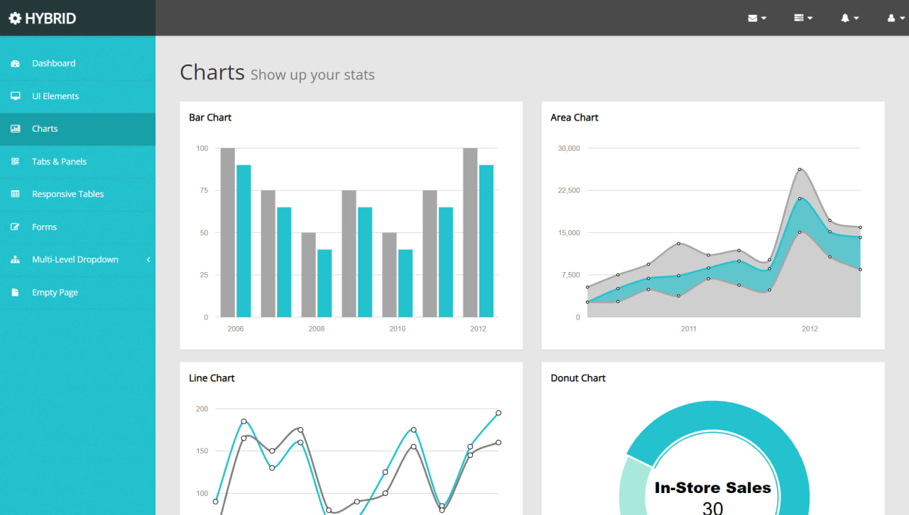
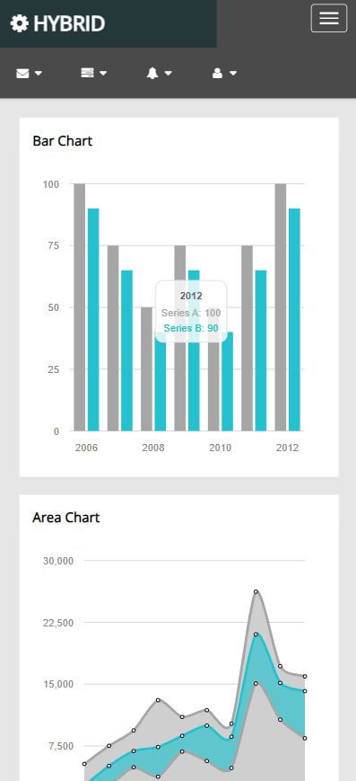

# Frontend-Dashboard-Page-Tutorials
My_Frontend || Dashboard-Page || 7 - Tutorial

## Screenshots
<table>
    <tr>
        <td>
            
        </td>
        <td>
            
        </td>
    </tr>
</table>

## Demo

[Live Demo](https://dashboard-page-tutorial-6.netlify.app)

## Tech Stack

- HTML
- CSS
- Bootstrap5
- JavaScript
- Responsive

## Authors

- [T.Oqilbek](https://www.github.com/tolqinov-o)

### My DashboardPage Demo Link

```
https://dashboard-page-tutorial-6.netlify.app
```