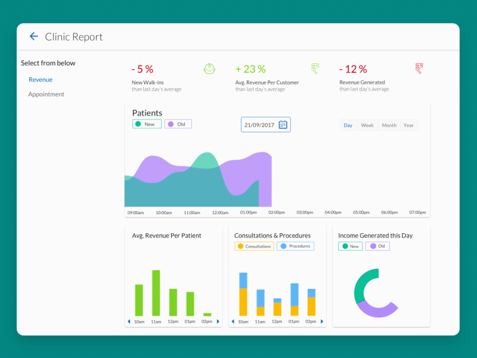

# Frontend-Dashboard-Page-Tutorials
My_Frontend || Dashboard-Page || 20 - Tutorials

## Dashboard Page Portfolio Demo Link

```
https://frontend-dashboard-portfolios.netlify.app
```

## All DashboardPage-tutorials

<table>
<tr>
<td>
◆ <a href="https://github.com/tolqinov-o/Frontend-DashboardPage-tutorial/tree/main/DashboardPage-1" target="_blank">Dashboard Page Tutorial - 1</a><br>
◆ <a href="https://github.com/tolqinov-o/Frontend-DashboardPage-tutorial/tree/main/DashboardPage-2" target="_blank">Dashboard Page Tutorial - 2</a><br>
◆ <a href="https://github.com/tolqinov-o/Frontend-DashboardPage-tutorial/tree/main/DashboardPage-3" target="_blank">Dashboard Page Tutorial - 3</a><br>
◆ <a href="https://github.com/tolqinov-o/Frontend-DashboardPage-tutorial/tree/main/DashboardPage-4" target="_blank">Dashboard Page Tutorial - 4</a><br>
◆ <a href="https://github.com/tolqinov-o/Frontend-DashboardPage-tutorial/tree/main/DashboardPage-5" target="_blank">Dashboard Page Tutorial - 5</a>
</td>
<td>
◆ <a href="https://github.com/tolqinov-o/Frontend-DashboardPage-tutorial/tree/main/DashboardPage-6" target="_blank">Dashboard Page Tutorial - 6</a><br>
◆ <a href="https://github.com/tolqinov-o/Frontend-DashboardPage-tutorial/tree/main/DashboardPage-7" target="_blank">Dashboard Page Tutorial - 7</a><br>
◆ <a href="https://github.com/tolqinov-o/Frontend-DashboardPage-tutorial/tree/main/DashboardPage-8" target="_blank">Dashboard Page Tutorial - 8</a><br>
◆ <a href="https://github.com/tolqinov-o/Frontend-DashboardPage-tutorial/tree/main/DashboardPage-9" target="_blank">Dashboard Page Tutorial - 9</a><br>
◆ <a href="https://github.com/tolqinov-o/Frontend-DashboardPage-tutorial/tree/main/DashboardPage-10" target="_blank">Dashboard Page Tutorial - 10</a>
</td>
</tr>
</table>


## Tech Stack

- HTML
- CSS
- JavaScript
- Bootstrap
- Responsive

## Author

- [T.Oqilbek](https://www.github.com/tolqinov-o)

### All DashboardPage Demo Links

<table>
<tr>
<td>
◆ <a href="https://dashboard-page-tutorial.netlify.app" target="_blank">Dashboard Page Tutorial - 1 || Live Demo</a><br>
◆ <a href="https://dashboard-page-tutorial-1.netlify.app" target="_blank">Dashboard Page Tutorial - 2 || Live Demo</a><br>
◆ <a href="https://dashboard-page-tutorial-2.netlify.app" target="_blank">Dashboard Page Tutorial - 3 || Live Demo</a><br>
◆ <a href="https://dashboard-page-tutorial-3.netlify.app" target="_blank">Dashboard Page Tutorial - 4 || Live Demo</a><br>
◆ <a href="https://dashboard-page-tutorial-4.netlify.app" target="_blank">Dashboard Page Tutorial - 5 || Live Demo</a>
</td>
<td>
◆ <a href="https://dashboard-page-tutorial-5.netlify.app" target="_blank">Dashboard Page Tutorial - 6 || Live Demo</a><br>
◆ <a href="https://dashboard-page-tutorial-6.netlify.app" target="_blank">Dashboard Page Tutorial - 7 || Live Demo</a><br>
◆ <a href="https://dashboard-page-tutorial-7.netlify.app" target="_blank">Dashboard Page Tutorial - 8 || Live Demo</a><br>
◆ <a href="https://dashboard-page-tutorial-8.netlify.app" target="_blank">Dashboard Page Tutorial - 9 || Live Demo</a><br>
◆ <a href="https://dashboard-page-tutorial-9.netlify.app" target="_blank">Dashboard Page Tutorial - 10 || Live Demo</a><br>
</td>
</tr>
</table>